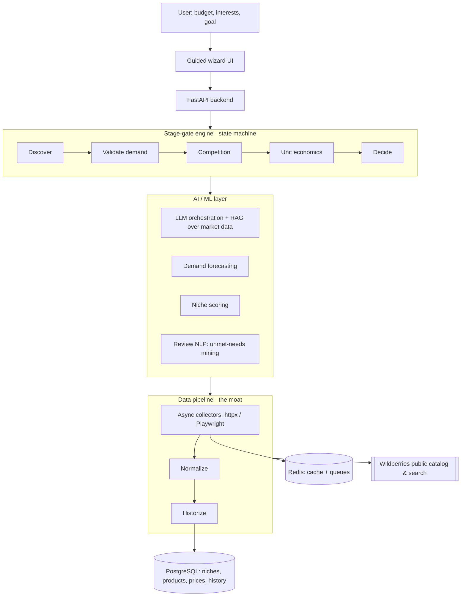

# Architecture

SellerCompass is built around one hard, valuable problem — **acquiring and historizing real marketplace data** — with an AI/ML layer on top that turns that data into decisions.



## Components

### 1. Guided wizard UI
A thin, linear front end that renders one stage at a time and its gate result. Not a dashboard — a wizard. (v0 can be a lightweight server-rendered UI; a richer SPA can come later.)

### 2. FastAPI backend
Async Python API. Owns the session, drives the stage-gate engine, exposes each stage's result to the UI.

### 3. Stage-gate engine
The heart (see [METHODOLOGY.md](METHODOLOGY.md)). A **state machine** — each stage is a node with a pass/fail gate. A failed gate routes back to the last viable branch (pivot). Deterministic and testable: gates are computed from data, not from the LLM.

### 4. Data pipeline — the moat
- **Collectors:** async workers that pull the Wildberries **public** catalog, search suggestions, result rankings, prices, and reviews (`httpx` for JSON endpoints, `Playwright` for JS-rendered pages).
- **Normalize:** raw payloads → a clean product/price/review schema.
- **Historize:** snapshots over time so we can compute trends and seasonality — this accumulating history is itself a competitive moat (it can't be back-filled later).

> **Note on data acquisition.** Official marketplace APIs mainly return _your own_ sales, not competitors'. Market research therefore relies on the **public** catalog — the same source MPStats & co. use. This pipeline is deliberately the hardest and most defensible part of the system.

### 5. AI / ML layer
- **LLM orchestration + RAG:** the LLM reasons over **retrieved real data**, so verdicts are grounded, not hallucinated. Bring-your-own-key in the open-source build.
- **Demand forecasting:** time-series over historized sales/search data (start simple — Prophet / statsmodels / gradient boosting).
- **Niche scoring:** a composite, later learnable, score that ranks candidates.
- **Review NLP:** aspect-based sentiment / topic extraction to surface recurring complaints = unmet needs.

### 6. Storage
- **PostgreSQL** — niches, products, prices, reviews, and their history.
- **Redis** — cache + task queues for the collectors.

## Open-core split (in the repo layout)

```
sellercompass/
├── core/        # OPEN (MIT): stage-gate engine, connectors, ML, self-host app
└── cloud/       # PLANNED, proprietary: hosted service, pre-collected data, billing
```

The open `core/` is fully runnable on its own — that is what earns stars and goes in a portfolio. `cloud/` monetizes the managed data infrastructure, not the algorithm.

## Deployment

One-command self-host via **Docker Compose** (API + Postgres + Redis + worker). Bring your own LLM key.
