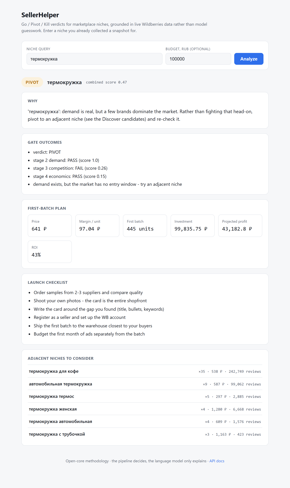
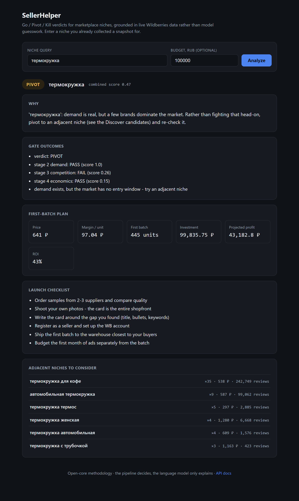

# SellerHelper

Открытый конвейер принятия решений для продавцов маркетплейсов. По исходному интересу он возвращает вердикт Go, Pivot или Kill по товарной нише, вычисленный на реальных данных выдачи Wildberries, а не на априорных представлениях языковой модели.

[](https://github.com/DenisDrobyshev/sellerhelper/actions/workflows/ci.yml)
[](LICENSE)
[](https://www.python.org/)

[English](README.md) | Русский

Репозиторий также размещен на платформе [GitLab](https://gitlab.com/DenisDrobyshev/sellerhelper).

Статус: версия v0, в разработке. Все пять стадий конвейера работают на живых данных. Поддерживается только Wildberries.

## Постановка задачи

Начинающие продавцы чаще всего ошибаются на этапе выбора товара, то есть до того, как принято хоть одно другое решение. Существующие инструменты делятся на две группы. Генераторы бизнес-планов выдают повествовательные советы с вымышленными цифрами. Аналитические сервисы (такие как: MPStats, Moneyplace, Jungle Scout, Helium 10) дают достоверные данные, но подают их в виде дашборда, что предполагает, будто пользователь заранее знает, какие конкретно метрики существенны и какой порог отделяет пригодную нишу от непригодной.

SellerHelper фиксирует эту экспертизу в виде последовательности стадий принятия решений. Каждая стадия вычисляет метрики по собранным карточкам и применяет явное условие прохождения. Не прошедшая стадия останавливает конвейер и сообщает числа, на которых основано решение.

## Конвейер

| Стадия | Что вычисляет | Условие прохождения |
|---|---|---|
| 1. Поиск ниши | Ниши-кандидаты, извлечённые из названий товаров, с агрегатами по цене и отзывам | отсутствует (дивергентная стадия) |
| 2. Проверка спроса | Суммарные отзывы по верхней выдаче, ценовой коридор, тренд спроса по накопленным снимкам | спрос выше порога и не падает |
| 3. Конкуренция | Концентрация брендов (доля отзывов у топ-3), ценовые полосы, слабые места лидеров | рынок не насыщен и есть хотя бы одно окно для входа |
| 4. Юнит-экономика | Комиссия, логистика, эквайринг, закупка, реклама и налог, далее маржа и план первой партии | маржа положительная и не ниже 10 процентов, размер партии приемлем |
| 5. Решение | Сводит вердикты стадий 2, 3 и 4 | отсутствует (терминальная стадия) |

Полные определения стадий и критерии ворот приведены в [METHODOLOGY.md](METHODOLOGY.md).

## Слой объяснений

Вердикт выносит конвейер; языковая модель его только объясняет. `core/llm.py` берёт готовое решение и превращает стоящие за ним числа в короткое объяснение на естественном языке, с инструкцией рассуждать строго по вычисленным воротами величинам и не привносить собственных данных. Слой необязателен и деградирует мягко: без ключа он возвращает детерминированный шаблон, поэтому инструмент работает офлайн, а набор тестов покрывает оба пути. Ключ `LLM_API_KEY` и, при необходимости, `LLM_MODEL` направляют тот же вызов в Claude через Anthropic SDK:

```bash
pip install -e ".[llm]"
export LLM_API_KEY=...     # без ключа объяснения используют встроенный шаблон
```

## Получение данных

Сбор данных Wildberries представляет собой ограничивающую задачу проекта, и реализация опирается на несколько измеренных фактов о поведении площадки.

Публичные JSON-эндпоинты (`search.wb.ru`, `card.wb.ru`, `feedbacks*.wb.ru`) ограничивают частоту запросов по IP-адресу. Первый запрос с резидентного адреса выполняется успешно. Последующие возвращают HTTP 429, а после серии попыток поисковый эндпоинт отдаёт HTTP 200 с пустым массивом товаров вместо ошибки, что легко принять за пустой рынок. То же ограничение действует для запросов, выполненных изнутри страницы на `wildberries.ru`, следовательно, блокировка привязана к адресу, а не к отпечатку клиента.

На отрисованную страницу выдачи это ограничение не распространяется. Она возвращает карточки товаров в тот момент, когда JSON-API ещё отклоняет запросы. Поэтому Selenium-коллектор управляет Chrome, открывает страницу результатов поиска, прокручивает её для подгрузки и считывает карточки из DOM. Один обход одного запроса даёт около 100 товаров с идентификатором, названием, брендом, ценой, рейтингом и числом отзывов.

В проекте два коллектора.

`core/collectors/wildberries.py` представляет собой асинхронный клиент httpx к JSON-API. Он применяет рандомизированный экспоненциальный backoff при 429, ограничивает частоту запросов и поддерживает прокси. Работает быстрее, когда адрес не ограничен.

`core/collectors/wb_selenium.py` содержит описанный выше Selenium-коллектор. Он медленнее, но возвращает данные в условиях ограничения частоты.

Разметка карточек использует хешированные имена CSS-классов, суффиксы которых меняются между выкладками, поэтому селекторы опираются на устойчивые подстроки вида `article.product-card`, а не на точные имена классов.

## Хранение

Каждый обход записывает пакет строк `ProductObservation` с общей меткой времени `collected_at`. Чтение последней метки даёт текущий снимок. Сравнение суммарных отзывов между метками даёт тренд спроса, который использует стадия 2.

Схему описывает SQLAlchemy, по умолчанию используется SQLite, что позволяет запускать проект без внешних сервисов. Для PostgreSQL достаточно задать `DATABASE_URL`.

Исторические снимки невозможно восстановить задним числом, поэтому сбор рассчитан на регулярный повтор во времени, а не на однократный запуск по требованию.

## Установка

```bash
git clone https://github.com/DenisDrobyshev/sellerhelper
cd sellerhelper
cp .env.example .env
pip install -e ".[dev]"
```

Selenium-коллектор требует локально установленного Chrome. Драйвер Selenium Manager подбирает автоматически.

## Использование

Сначала собрать снимок, затем запустить всю воронку или любую отдельную стадию по сохранённым данным:

```bash
python -m core.collectors.wb_selenium "термокружка"             # обход и запись снимка
python -m core.engine.pipeline       --db "термокружка" 100000   # все пять стадий разом

python -m core.engine.discover       --db "термокружка"          # стадия 1
python -m core.engine.demand         --db "термокружка"          # стадия 2
python -m core.engine.competition    --db "термокружка"          # стадия 3
python -m core.engine.unit_economics --db "термокружка" 100000   # стадия 4, бюджет в рублях
python -m core.engine.decide         --db "термокружка" 100000   # стадия 5
```

Те же стадии доступны по HTTP:

```bash
uvicorn core.main:app --reload      # http://localhost:8000/docs
```

| Эндпоинт | Стадия |
|---|---|
| `GET /stages/discover?seed=&budget=` | 1 |
| `GET /stages/demand?query=` | 2 |
| `GET /stages/competition?query=` | 3 |
| `GET /stages/economics?query=&price=&budget=&cogs=` | 4 |
| `GET /stages/decide?query=&budget=` | 5 |
| `GET /stages/pipeline?query=&budget=` | все пять |

Ответы `pipeline` и `decide` дополнительно содержат текстовое поле `explanation`, описанное выше.

## Веб-интерфейс

Тот же процесс отдаёт одностраничный веб-интерфейс по корневому пути. Он принимает запрос ниши и необязательный бюджет, вызывает эндпоинт конвейера и показывает вердикт, исходы ворот, объяснение на естественном языке, план первой партии и смежные ниши для рассмотрения. Страница самодостаточна, без сборки и внешних ресурсов, и работает по нишам, для которых уже есть сохранённый снимок.

```bash
uvicorn core.main:app --reload      # http://localhost:8000/
```



<details>
<summary>Тот же интерфейс, тёмная тема</summary>



</details>

## Сбор по расписанию

Зарегистрируйте запросы и обходите их по расписанию (cron или Планировщик заданий Windows). Каждый проход сохраняет снимок с меткой времени, что и даёт тренду стадии 2 реальный интервал для измерения.

```bash
python -m core.scheduler --add "термокружка"   # зарегистрировать запрос
python -m core.scheduler --list                 # показать список наблюдения
python -m core.scheduler                        # обойти все наблюдаемые запросы один раз
```

`docker compose up --build` поднимает API без какой-либо настройки. По умолчанию используется SQLite на персистентном томе, есть health check; PostgreSQL и Redis запускаются рядом для опционального использования.

```bash
docker compose up --build      # http://localhost:8000/health
```

## Пример

Вывод стадии 5 по запросу `термокружка` с бюджетом 100 000 рублей, вычисленный по сохранённому снимку:

```
Stage 5 . Decide - 'термокружка'
   verdict: PIVOT
   stage 2 demand:      PASS (score 1.0)
   stage 3 competition: FAIL (score 0.26)
   stage 4 economics:   PASS (score 0.15)
   demand exists, but the market has no entry window - try an adjacent niche

   'термокружка': demand is real, but a few brands dominate the market. Rather than fighting
   that head-on, pivot to an adjacent niche (see the Discover candidates) and re-check it.

  First-batch plan:
   price 641.0 RUB | margin 97.04 RUB/unit
   445 units for 99835.75 RUB
   projected profit 43182.8 RUB (ROI 43%)
```

Вердикт PIVOT получен потому, что три ведущих бренда удерживают 74 процента объёма отзывов в этой нише, хотя спрос высок, а юнит-экономика проходит порог по марже. Абзац под строками ворот — это слой объяснений, работающий без ключа, на встроенном шаблоне; с ключом он заново формируется Claude по тем же числам.

## Структура репозитория

```
core/
  api/          маршруты FastAPI (health и пять стадийных эндпоинтов)
  collectors/   коллекторы Wildberries: клиент JSON-API и Selenium-паук
  engine/       движок стадий: discover, demand, competition, unit_economics, decide
  llm.py        необязательный слой объяснений: шаблон-фолбэк, Claude при наличии ключа
  models/       нормализованная модель товара, независимая от маркетплейса
  storage/      модели SQLAlchemy и репозиторий снимков
  web/          самодостаточный одностраничный веб-интерфейс по корневому пути
tests/          45 модульных тестов, доступ в сеть не требуется
```

## Проектные решения

Проект построен по модели open core. Движок, коллекторы и self-hosted развёртывание распространяются по лицензии MIT. Размещённый сервис с предварительно собранными историческими данными планируется отдельно. Защищаемым активом является инфраструктура сбора и накопленный временной ряд, а не код расчётов, который короток и легко воспроизводим.

Стадия 3 измеряет концентрацию по брендам, а не по продавцам, поскольку карточки выдачи содержат бренд и не содержат продавца. Группировка объёма отзывов по брендам приближает структуру рынка на данных, которые действительно доступны.

Стадия 3 также использует слабые места лидеров, то есть популярные карточки с посредственным рейтингом, как замену прямому анализу незакрытых потребностей. Методология предполагает извлечение повторяющихся жалоб из отзывов конкурентов. Функция `analyze_reviews` в `core/engine/competition.py` реализует это извлечение и покрыта тестами, но пока не имеет источника данных (см. раздел об ограничениях).

Пороги ворот заданы константами уровня модуля, а не обучаемыми параметрами. Они откалиброваны вручную и задокументированы рядом с применяющим их кодом, поэтому продавец может изменить их под свою категорию без переобучения.

Допущения о комиссиях в стадии 4 вынесены в параметры функций со значениями по умолчанию, что позволяет подставить реальные закупочные цены и категорийные комиссии, не редактируя модель.

## Известные ограничения

Тексты отзывов не собираются. JSON-эндпоинты отзывов ограничены по частоте, а страница отзывов использует хешированные имена классов, среди которых ответы продавца перемешаны с отзывами покупателей. Поэтому стадия 3 опирается на слабые места по рейтингу, а не на анализ жалоб.

Классификация тренда требует не менее двух снимков, разнесённых во времени. Единственный обход даёт тренд unknown, и стадия 2 опирается только на уровень спроса.

Значения комиссий в стадии 4 по умолчанию не зависят от категории и являются приближением. Они дают реалистичную первую оценку, а не бухгалтерскую величину.

Selenium-коллектор требует локально установленного Chrome. При повторных запусках в рамках одной сессии Chrome иногда не стартует, повторный запуск команды решает проблему.

Движок, хранение и модель Product не зависят от маркетплейса, а коллектор Ozon (`core/collectors/ozon.py`) реализует тот же интерфейс: воронка работает на товарах Ozon без изменений. Живой сбор с Ozon блокирует антибот, отдающий автоматическому браузеру страницу-заглушку; для него нужны резидентные прокси и stealth, что вне рамок проекта. Amazon и Etsy остаются в плане.

## Тестирование

Набор тестов покрывает разбор цен, сохранение снимков, классификацию тренда, извлечение ниш и все условия ворот. Тесты выполняются без сети. GitHub Actions запускает `ruff` и `pytest` при каждом пуше.

```bash
ruff check core tests
pytest -q
```

## Документация

В [METHODOLOGY.md](METHODOLOGY.md) определены стадии и их ворота. В [ARCHITECTURE.md](ARCHITECTURE.md) описаны компоненты и потоки данных. В [ROADMAP.md](ROADMAP.md) перечислены выполненные и запланированные работы.

## Лицензия

[MIT](LICENSE), Copyright 2026 Denis Drobyshev.
